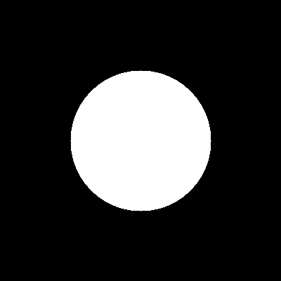
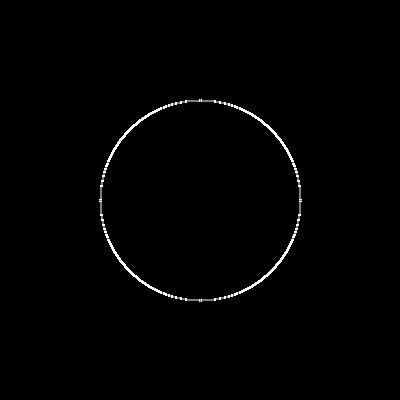
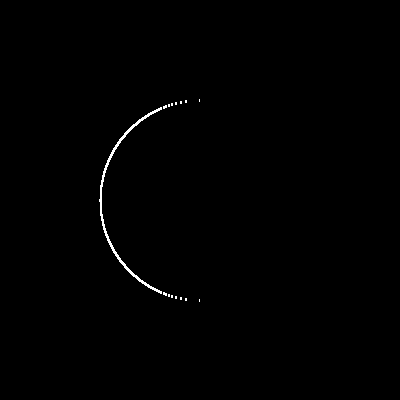
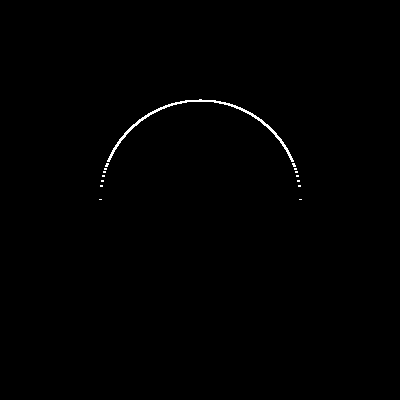
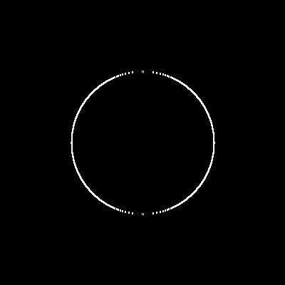
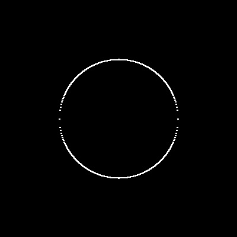

# Sobel Gradient 3x3

For the given image:

```cpp
0 0 0 0 0 0 0 0 0 0 0 0
0 0 0 0 0 0 0 0 0 0 0 0
0 0 0 0 1 1 1 1 0 0 0 0
0 0 0 1 1 1 1 1 1 0 0 0
0 0 1 1 1 1 1 1 1 1 0 0
0 0 1 1 1 1 1 1 1 1 0 0
0 0 1 1 1 1 1 1 1 1 0 0
0 0 0 1 1 1 1 1 1 1 0 0
0 0 0 0 1 1 1 1 1 0 0 0
0 0 0 0 0 1 1 1 0 0 0 0
0 0 0 0 0 0 0 0 0 0 0 0
0 0 0 0 0 0 0 0 0 0 0 0
```

The following results are obtained when applying the Sobel 3x3 gradient filter:

| Original Image | Gradient Image |
|:--------------:|:--------------:|
|||
|||
|||

However, performing the same experiment for a larger image can yield more visually interesting results.

| Original Image | Gradient Image |
|:--------------:|:--------------:|
|||
|||
|||